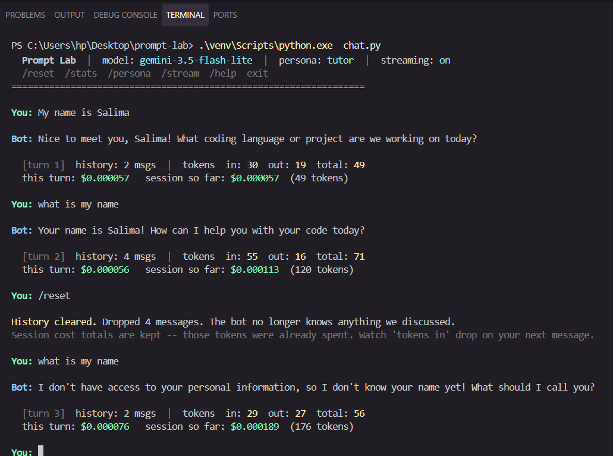

# Prompt Lab

[](https://github.com/Iddrisusalima/prompt-lab/actions/workflows/ci.yml)
[](https://www.python.org/downloads/)
[](LICENSE)
[](https://ai.google.dev/)
[](https://peps.python.org/pep-0008/)

A command-line chat tool for Google's Gemini models that shows you exactly what
every conversation costs. It holds a normal back-and-forth chat, remembers what
was said, and after each reply prints the tokens sent, the tokens received, the
price of that turn, and a running total for the session. The goal was not just a
working chatbot but making the invisible parts visible — you can watch the token
count climb with every message and see, in real numbers, why memory is the thing
you are paying for.

Built as Project 1 of an AI engineering mentorship.

---

## Demo

> **Video walkthrough:** _add link here_



The clearest 20 seconds in the project is visible in that screenshot — the same
question asked either side of a `/reset`:

```text
You: what is my name
Bot: Your name is Salima! How can I help you with your code today?
  [turn 2]  history: 4 msgs  |  tokens  in: 55  out: 16  total: 71

You: /reset
History cleared. Dropped 4 messages. The bot no longer knows anything we discussed.

You: what is my name
Bot: I don't have access to your personal information, so I don't know your name
     yet! What should I call you?
  [turn 3]  history: 2 msgs  |  tokens  in: 29  out: 27  total: 56
```

First time it knew my name. Seconds later it did not. Nothing about the model
changed — I deleted a list on my own laptop and the memory went with it, because
that list **was** the memory. Notice `tokens in` fell from 55 to 29, because there
was no history left to re-send.

In a longer session the same effect is far more dramatic. With 44 messages of
history the identical four-word question cost **822 input tokens**; immediately
after `/reset` it cost **29**. A **28x drop**, for the same question.

---

## Table of contents

- [Architecture](#architecture)
- [Project layout](#project-layout)
- [Prerequisites](#prerequisites)
- [Installation](#installation)
- [Usage](#usage)
- [Key concepts](#key-concepts)
- [Pricing](#pricing)
- [Verification](#verification)
- [Stretch goals](#stretch-goals)
- [Documentation](#documentation)

---

## Architecture

The model is **stateless**. It retains nothing between requests. So memory cannot
live in the model, and it does not — it lives in a Python list inside `chat.py`
that is re-sent in full on every single request. That one fact drives the whole
design, and it is why the token count climbs every turn.

```mermaid
flowchart TD
    A([User types a message]) --> B{Is it a command?}

    B -->|"/reset /stats /persona<br/>/stream /help"| C["Handled locally<br/><i>no API call, no cost</i>"]
    C --> A

    B -->|normal message| D["Append to history<br/>role = user"]
    D --> E["Build request:<br/>system_instruction<br/>+ <b>ENTIRE history</b>"]

    E --> F([Gemini API])

    F -->|failure| G["history.pop&#40;&#41; rolls back<br/>Explain by HTTP code:<br/>401 key · 404 model<br/>429 quota · 5xx theirs"]
    G --> A

    F -->|success| H["Reply text<br/>+ usage_metadata"]
    H --> I["Append to history<br/>role = model"]
    I --> J["cost_of&#40;input, output&#41;<br/>Update session totals"]
    J --> K["Print reply, tokens<br/>and cost for this turn"]
    K --> A

    style E fill:#fff3cd,stroke:#856404,color:#000
    style G fill:#f8d7da,stroke:#721c24,color:#000
    style J fill:#d4edda,stroke:#155724,color:#000
```



### Components

- **REPL loop** (`chat.py` main `while` block) — reads input, routes commands
  before they can reach the network, and drives one turn per message.
- **Memory store** (`history`, a `list[types.Content]`) — the bot's entire memory,
  held in process. Written by `add_turn()` for both user and model turns.
- **Request builder** (`send_once()` / `send_streaming()`, sharing `config()`) —
  attaches the persona as `system_instruction` and the full history as `contents`.
- **Cost accountant** (`cost_of()` plus the `session` dict) — reads
  `usage_metadata` off each response and bills input and output at separate rates.
- **Error translator** (`explain_api_error()`) — maps HTTP status codes onto
  actionable human messages, paired with `history.pop()` to roll back failures.
- **Persona library** (`PERSONAS` dict) — five system prompts, swappable at
  runtime without touching history.

### One full turn, end to end

The loop reads a line and first checks whether it is a command; commands like
`/reset` and `/stats` are served locally and never reach the API, so they cost
nothing. Anything else is appended to `history` as a `user` turn, then the request
builder sends the persona plus **the entire history** to Gemini. On success the
reply is appended back as a `model` turn, `usage_metadata` is converted to a dollar
figure, the session totals are updated, and the turn's tokens and cost are printed
beneath the reply. On failure nothing is appended: `history.pop()` removes the user
turn so the transcript cannot end on an unanswered message, the error is explained
by status code, and the loop returns to the prompt. History only grows, which is
why input tokens — and therefore cost — climb with every turn until `/reset`.

### Two design decisions worth stating

- **Streaming does not bypass cost tracking.** With `generate_content_stream()`,
  `usage_metadata` arrives on the *final* chunk rather than all at once, so the
  loop keeps the last one it receives. Streaming changes perceived speed, not
  price.
- **`/reset` clears history but keeps the cost totals.** Clearing memory does not
  un-spend money, so zeroing the bill would be dishonest accounting.

---

## Project layout

```text
chat.py                  Main CLI application — memory, tokens, cost, personas,
                         streaming, commands, error handling
day1_hello.py            Learning script: baseline single-turn call, no memory
day2_roles.py            Learning script: role/persona experiment, prints the
                         full JSON request payload before sending

requirements.txt         Pinned dependencies
.env.example             Template for environment variables (tracked)
.env                     Your real API key (git-ignored, never committed)
.gitignore               Excludes .env, venv/, caches

README.md                This file
NOTES.md                 Day-by-day build log: every bug and its lesson
docs/
  learnings.md           Full conceptual write-up: tokens, context windows,
                         roles, statelessness, provider comparison
  screenshots/           Terminal captures + a guide for taking them
.github/
  workflows/ci.yml       CI: compiles all scripts and asserts the missing-key
                         path exits 1, across Python 3.10 / 3.11 / 3.12
```

`chat.py` is the only file you need to run. The two `day*.py` scripts are kept
deliberately: each isolates one concept and documents how the tool was built.

---

## Prerequisites

| Requirement | Details |
| --- | --- |
| **Python** | 3.10 or newer. Developed on 3.12.5, CI tests 3.10 / 3.11 / 3.12. |
| **API key** | Free from [Google AI Studio](https://aistudio.google.com/apikey). No payment method needed. |
| **Git** | Only needed to clone the repository. |
| **OS** | Cross-platform. Developed on Windows 11 (PowerShell), CI runs on Ubuntu. |

Everything runs on Gemini's free tier, so following this guide costs nothing.

---

## Installation

### 1. Clone the repository

```bash
git clone https://github.com/Iddrisusalima/prompt-lab.git
cd prompt-lab
```

### 2. Create a virtual environment

<details open>
<summary><b>Windows (PowerShell)</b></summary>

```powershell
python -m venv venv
venv\Scripts\Activate.ps1
```

</details>

<details>
<summary><b>macOS / Linux (Bash)</b></summary>

```bash
python3 -m venv venv
source venv/bin/activate
```

</details>

> **Note for Windows users:** if activation is blocked by execution policy, run
> `Set-ExecutionPolicy -Scope Process -ExecutionPolicy Bypass` first. Alternatively
> skip activation entirely and call the interpreter directly with
> `venv\Scripts\python.exe` in place of `python`.

### 3. Install dependencies

Once the environment is active, this is the same command on every platform:

```bash
pip install -r requirements.txt
```

### 4. Add your API key

```bash
cp .env.example .env
```

On Windows PowerShell:

```powershell
Copy-Item .env.example .env
```

Then open `.env` and fill it in:

```ini
GEMINI_API_KEY=your_real_key_here
GEMINI_MODEL=gemini-3.5-flash-lite
```

`.env` is listed in `.gitignore`, so your key stays on your machine and cannot be
committed. Only `.env.example`, which holds no real values, is tracked.

### 5. Run it

```bash
python chat.py
```

<details>
<summary><b>Windows: fixing mangled characters</b></summary>

If the model's em-dashes appear as `ΓÇö`, your console is using the wrong codepage.
Run this once per session:

```powershell
[Console]::OutputEncoding = [System.Text.Encoding]::UTF8
```

</details>

---

## Usage

### Commands available while chatting

| Command | What it does |
| --- | --- |
| `/reset` | Clears conversation history. Cost totals are kept, since those tokens were already spent. |
| `/stats` | Shows running session totals, split by direction. |
| `/persona` | Lists personas, or switches with `/persona pirate`. |
| `/stream` | Toggles word-by-word streaming. |
| `/help` | Lists the commands. |
| `exit` | Quits and prints the final bill. |

Commands are handled locally and never reach the API, so they cost nothing.

### Command line flags

| Flag | What it does |
| --- | --- |
| `--model NAME` | Picks a model, overriding `.env`. |
| `--persona NAME` | Starts with a persona: `tutor`, `pirate`, `teacher`, `terse`, or `rubberduck`. |
| `--no-stream` | Waits for the whole reply instead of streaming it. |
| `--list-models` | Lists models your key can use, then exits. |
| `--help` | Shows all flags. |

```bash
python chat.py --persona pirate --model gemini-3.6-flash
```

> `--list-models` is optimistic. Some models it lists still fail when called
> because they are retired for new accounts. The only real test is calling one,
> and the tool reports that failure clearly.

### Example session

```text
==================================================================
  Prompt Lab  |  model: gemini-3.5-flash-lite  |  persona: tutor  |  streaming: on
  /reset  /stats  /persona  /stream  /help  exit
==================================================================

You: My name is Salima.

Bot: Nice to meet you, Salima! How can I help you with your coding journey today?

  [turn 1]  history: 2 msgs  |  tokens  in: 31  out: 19  total: 50
  this turn: $0.000057   session so far: $0.000057  (50 tokens)

You: What is my name?

Bot: Your name is Salima! What would you like to code today?

  [turn 2]  history: 4 msgs  |  tokens  in: 57  out: 14  total: 71
  this turn: $0.000052   session so far: $0.000109  (121 tokens)

You: /stats

------------------------------------------------------------------
  SESSION TOTALS
    model           : gemini-3.5-flash-lite
    persona         : tutor
    turns completed : 2
    messages in history: 4
    input tokens    :      88   $0.000026
    output tokens   :      33   $0.000083
    total tokens    :     121
    estimated cost  : $0.000109  (free tier: actually $0.00)
    73% of those tokens were input -- that is the cost of memory.
------------------------------------------------------------------
```

---

## Key concepts

Short version here. The full write-up, with all the measurements behind it, is in
**[`docs/learnings.md`](docs/learnings.md)**.

**Tokens** are chunks of text the model treats as single units, roughly 4
characters of English. The model never sees text, only token IDs. Tokens are both
what the context window is measured in and what you are billed for. Two things
surprised me: output costs about **8x more per token** than input, and
`total_token_count` is **not always input + output** — `gemini-3.6-flash` reported
4 in and 2 out but 62 total, the difference being billed "thinking" tokens.
→ [Read more](docs/learnings.md#tokens)

**Context windows** are the ceiling on how many tokens the model can consider at
once, covering the system instruction, all history, and the reply. Around 1M
tokens for Flash-Lite. The insight is that it caps a number which only ever grows,
so long conversations eventually stop fitting and old turns must be dropped.
→ [Read more](docs/learnings.md#context-windows)

**Roles** label who said each message so a stateless model can reconstruct a
conversation. `user` is you, `model` is the bot's earlier turns (OpenAI calls this
`assistant`), and the system instruction is standing guidance passed as config —
**Gemini has no `role="system"` at all**.
→ [Read more](docs/learnings.md#roles)

**Statelessness** is the idea underneath everything. Memory is re-sending, not
recalling, which is why cost grows closer to the *square* of conversation length
than linearly — turn 10 pays for turns 1 through 9 again. Measured input tokens
climbing from 30 to 654 across 18 turns without my messages getting any longer.
→ [Read more](docs/learnings.md#the-idea-that-tied-it-all-together)

---

## Pricing

Rates for `gemini-3.5-flash-lite` from
[Google's official pricing page](https://ai.google.dev/gemini-api/docs/pricing),
checked 9 September 2026:

| Direction | Per 1M tokens | Per 1K tokens |
| --- | --- | --- |
| Input | $0.30 | $0.0003 |
| Output | $2.50 | $0.0025 |

The free tier costs **$0.00**, so the figures the tool prints are what the
conversation *would* cost at paid-tier rates. The output labels this plainly rather
than implying you are being billed.

Rates for other models live in the `PRICING_PER_1M` table in `chat.py`, and the
tool warns you when the selected model has no rates on file.

### Where the money actually goes

From one real 23-turn session:

| Direction | Tokens | Share of tokens | Cost | Share of cost |
| --- | --- | --- | --- | --- |
| Input | 8,982 | 92.5% | $0.002695 | 60% |
| Output | 725 | 7.5% | $0.001813 | 40% |

Output was 7.5% of the tokens but 40% of the bill. So there are two independent
cost levers: trim history to cut input, and ask for brevity to cut output.

---

## Verification

Every failure below was deliberately triggered and the behaviour observed, not
merely coded for and assumed.

### Automated

CI runs on every push across Python 3.10, 3.11 and 3.12. It compiles all three
scripts, loads the CLI and parses its flags, then asserts that running with no key
exits with code 1 and prints `No API key found`. It makes no API calls, so it needs
no secrets and costs nothing.

```bash
python -m compileall -q chat.py day1_hello.py day2_roles.py
python chat.py --help
```

### Manual failure injection

| Failure | How it was forced | Behaviour |
| --- | --- | --- |
| Missing API key | Ran with no `.env` present | Plain-English fix instructions, exit code 1, no traceback |
| Invalid API key | Set `GEMINI_API_KEY` to a bad value | `HTTP 401` and where to get a fresh key. Tool keeps running. |
| Unknown model | Set `GEMINI_MODEL=gemini-does-not-exist` | `HTTP 404`, and it notes your key is fine since auth succeeded |
| No network | Pointed the client at a dead port | Catches `httpx.ConnectError`, reports a connection problem |
| Rate limit | Not forced, to avoid burning quota | `HTTP 429` handled with a wait-and-retry message |
| Empty reply | Not forced | Explains a safety filter likely blocked it, suggests rephrasing |
| Ctrl+V paste | Pressed Ctrl+V in a Windows console | Detects the literal control character, explains Ctrl+V does not paste, and sends nothing |

Two principles behind this:

**Status codes get different treatment**, because retrying a rejected key is
pointless while retrying a rate limit is sensible. A 404 in particular is reported
as *"your key is fine, the model name is wrong"* — a distinction that is easy to
misdiagnose.

**A failed request never corrupts the conversation.** The user message is rolled
back out of history so the transcript cannot end on an unanswered turn.

---

## Stretch goals

All three optional goals completed.

- [x] **Streaming** — replies print word by word. Toggle with `/stream` or start
      with `--no-stream`. Usage data still returns intact, arriving on the final
      chunk.
- [x] **`--model` flag** — switch models from the command line, overriding `.env`.
      Plus `--list-models`.
- [x] **Persona library** — five system prompts, switchable mid-conversation.

### What the persona library revealed

Asking `What is 15 + 27?` under three personas gave an **87x spread in output
tokens**:

| Persona | Reply | Output tokens | Cost |
| --- | --- | --- | --- |
| `pirate` | A tobacco-spitting rant, then concedes **42** | 175 | $0.000450 |
| `teacher` | Refuses to answer, asks a guiding question instead | 55 | $0.000206 |
| `terse` | `42` | 2 | $0.000093 |

The `teacher` persona would not state the answer at all. That is a change in what
the tool *does*, produced by one sentence of instruction with no code modified.

Better still, after switching from `pirate` to `teacher` mid-conversation, the
teacher opened with *"Put that cutlass away this instant."* No cutlass had been
mentioned to the teacher — the pirate raised one two turns earlier. Switching
persona replaces the system instruction but keeps the history, so that single line
proves the two are independent channels.

### Extras beyond the brief

- [x] `/stats` and `/help` commands
- [x] `/stats` splits cost by direction and reports what share of tokens were input
- [x] Colour output that disables itself automatically when piped to a file
- [x] Multi-model pricing table with a warning for unpriced models
- [x] History rollback on failed requests
- [x] Control-character input filtering, so a mistyped paste costs nothing
- [x] CI across Python 3.10, 3.11 and 3.12

---

## Documentation

| Document | Contents |
| --- | --- |
| [`docs/learnings.md`](docs/learnings.md) | Full conceptual write-up: tokens, context windows, roles, training vs inference, statelessness, provider comparison, and the self-check answers. |
| [`NOTES.md`](NOTES.md) | Day-by-day build log. Every bug I hit, why it happened, and what it taught me. |

---

## License

[MIT](LICENSE)
